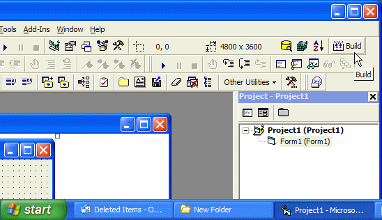



## Add a VC\+\+ like 'Build' Button to your VB6 Toolbar Without any AddIns

### Description

Ever wish you had a 'Build' button in vb6 just like VC++, now you can add a build button to your visual basic 6 toolbar. There are addins available for doing it but they are part of a paid addin products, but my methods don't uses addins etc. Just download the zip and read the instructions. zip also contains image for build button. AND PLEASE VOTE.
 
### More Info
 

             |
---                |---
**Submitted On**   |2004-12-02 02:54:06
**By**             |[Abhishek\.NET](https://github.com/Planet-Source-Code/PSCIndex/blob/master/ByAuthor/abhishek-net.md)
**Level**          |Beginner
**User Rating**    |4.6 (69 globes from 15 users)
**Compatibility**  |VB 4\.0 \(32\-bit\), VB 5\.0, VB 6\.0
**Category**       |[Miscellaneous](https://github.com/Planet-Source-Code/PSCIndex/blob/master/ByCategory/miscellaneous__1-1.md)
**World**          |[Visual Basic](https://github.com/Planet-Source-Code/PSCIndex/blob/master/ByWorld/visual-basic.md)
**Archive File**   |[Add\_a\_VC\+\+1824851232004\.zip](https://github.com/Planet-Source-Code/abhishek-net-add-a-vc-like-build-button-to-your-vb6-toolbar-without-any-addins__1-57496/archive/master.zip)

